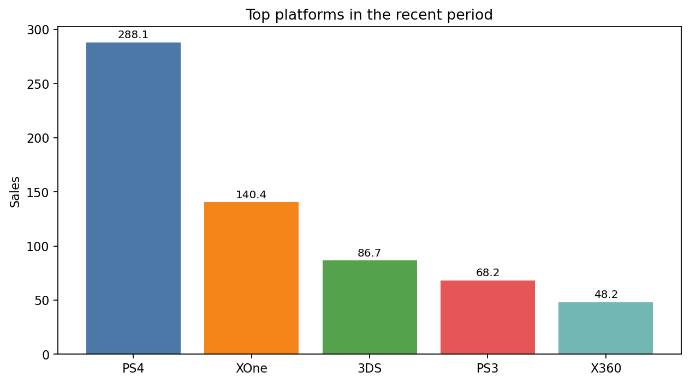
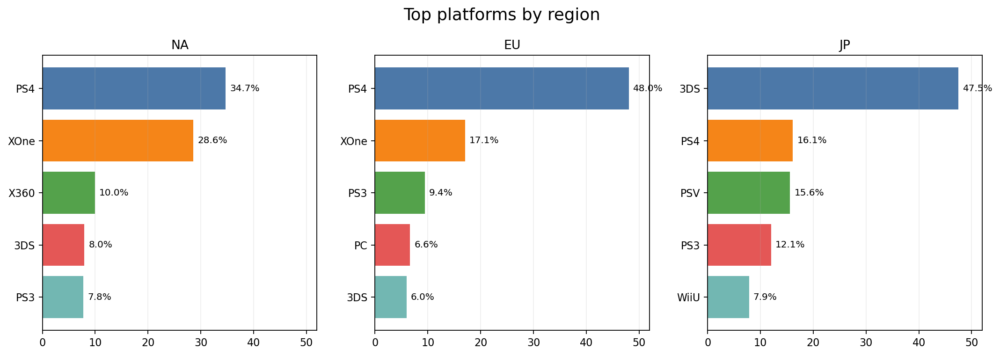

# game market analysis

## overview

an analysis of historical video game sales data aimed at identifying the strongest signals of commercial success across platforms, genres, and regions.

## business question

which market patterns are most useful for understanding sales performance and supporting product and marketing decisions?

## approach

- cleaned and standardized the dataset
- compared sales patterns across platforms, genres, and regions
- examined the relationship between reviews, ratings, and sales
- tested selected hypotheses

## key findings

- platform lifecycle and regional demand patterns were the strongest signals in sales performance
- genre preferences differed meaningfully across regions
- review scores added context, but did not explain commercial success on their own

## tools

python, pandas, numpy, scipy, matplotlib, seaborn

## notebook

- [open notebook](./notebook.ipynb)
