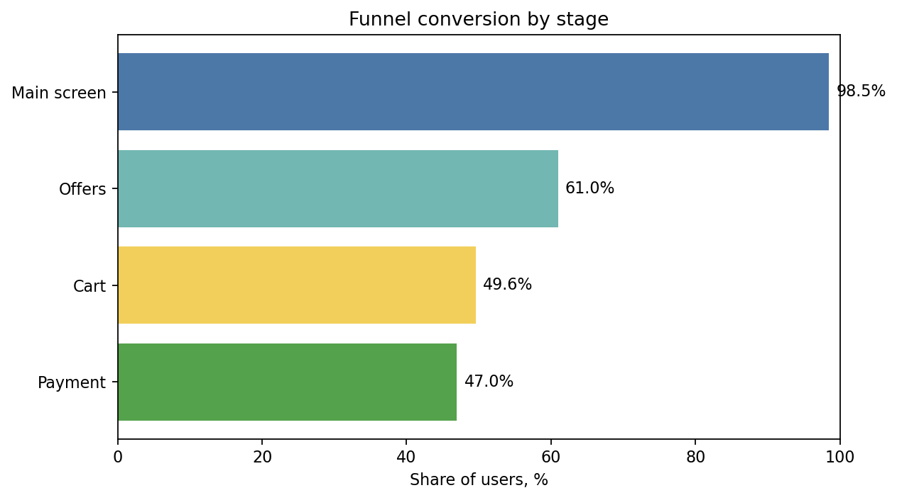
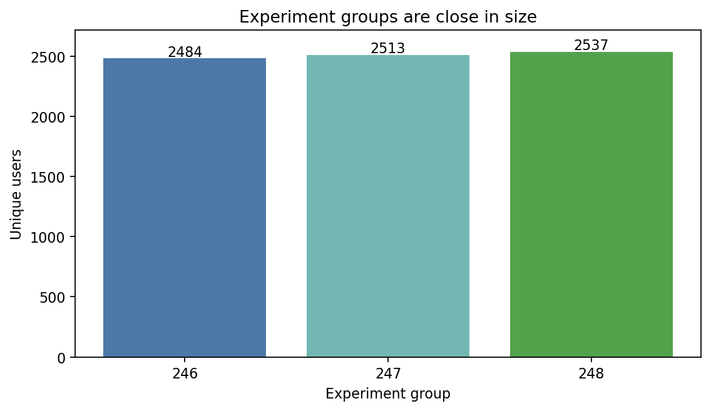

# mobile funnel and experiment analysis

## overview

an analysis of mobile app user behavior focused on funnel conversion and experiment results to assess whether a product change had a measurable impact.

## business question

where do users drop off in the funnel, and did the tested interface change affect user behavior in a statistically meaningful way?

## approach

- cleaned and validated event data
- built and analyzed the user funnel
- compared user behavior across experiment groups
- ran statistical tests to evaluate the product change

## key findings

- the funnel showed the main points of user drop-off between product steps
- the experiment groups were suitable for comparison
- the tested change did not produce a statistically significant effect on behavior

## tools

python, pandas, numpy, scipy, matplotlib, seaborn

## notebook

- [open notebook](./notebook.ipynb)
