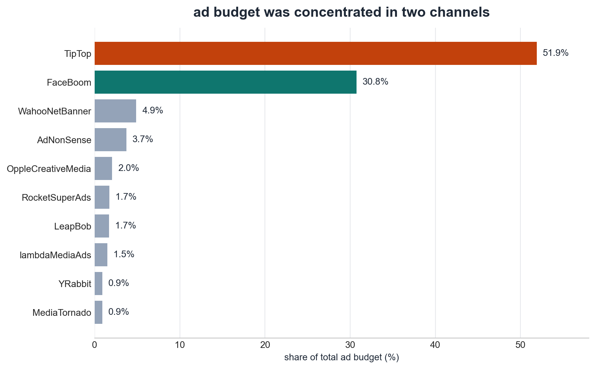
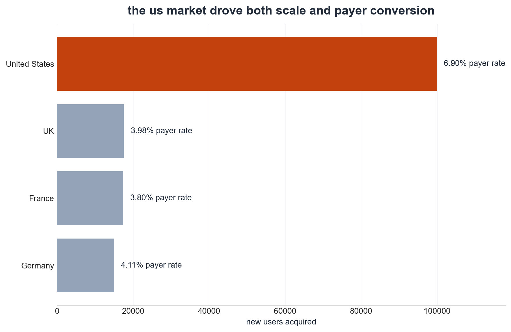

# procrastinate pro+ growth analysis

## overview

an analysis of acquisition, retention, and unit economics for procrastinate pro+, focused on understanding why rising ad spend was not turning into profit.

the main issue was not weak conversion, but poor payback in the us market and overinvestment in expensive channels such as TipTop and FaceBoom.

## business question

which markets, devices, and acquisition channels were driving losses, and where should marketing budget be reallocated to restore payback?

## approach

- built user profiles by region, device, and acquisition channel
- analyzed cac, ltv, roi, retention, and conversion over a 14-day payback window
- compared unit economics across markets and channels
- identified segments with strong conversion but weak long-term payback

## key findings

- 82.6% of the ad budget was concentrated in TipTop and FaceBoom, while overall roi still stayed below the two-week payback target
- the us market drove the largest share of acquired users and the highest payer rate, but retention there was materially weaker than in europe
- FaceBoom converted well but retained poorly, while TipTop kept getting more expensive to acquire, making both channels unattractive for sustained growth
- european acquisition sources, especially lambdaMediaAds, showed a more balanced payback profile and looked like better candidates for reallocation

## tools

python, pandas, numpy, matplotlib, cohort analysis, unit economics

## notebook

- [open notebook](./notebook.ipynb)
